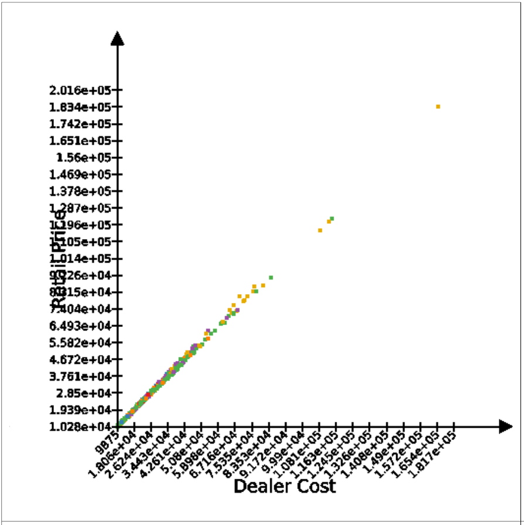
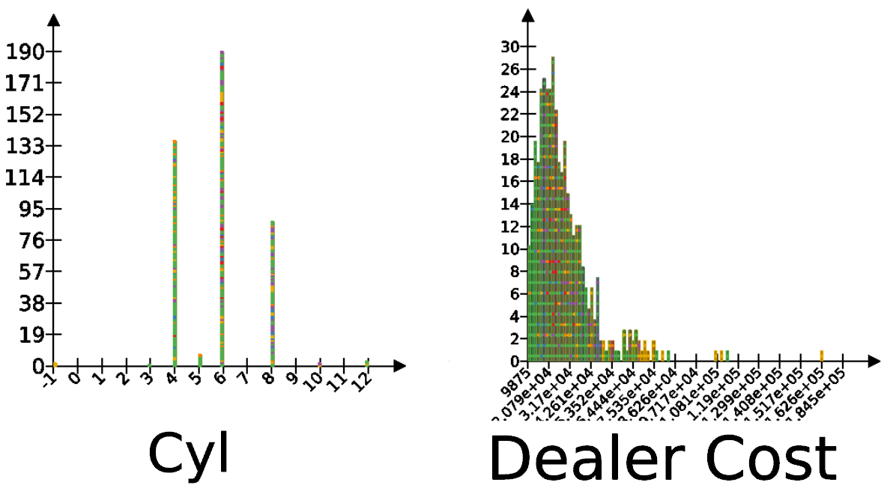
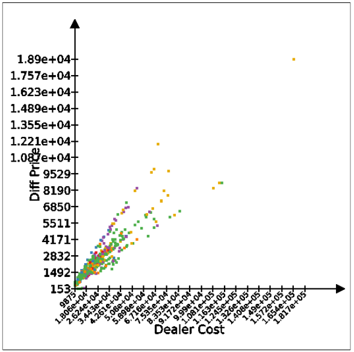
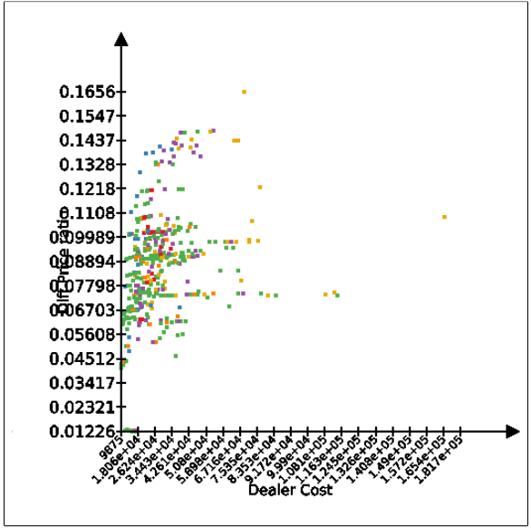
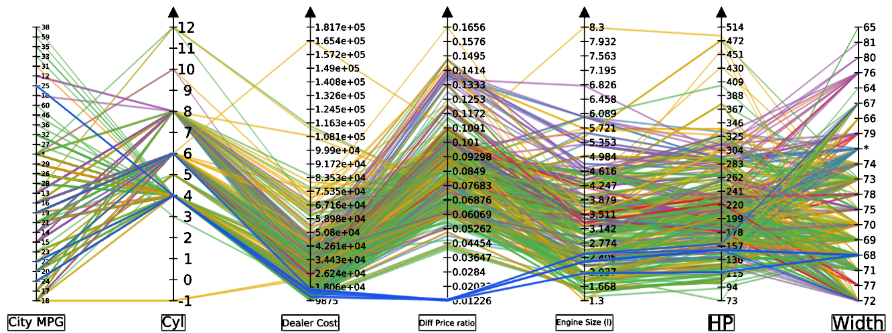
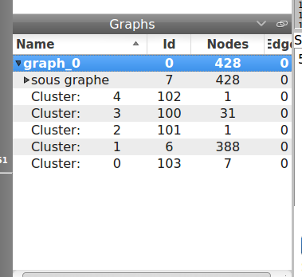

# Visualisation de données - Cars 2004 - Luc Libralesso

# Le jeu de données

Le jeu de données présente un ensemble de 428 véhicules de 2004.

Un certain nombre de champs sont renseignés, comme le prix, la taille, le nombre de miles par gallon.

De ce jeu de données, quelqu'un pourrait être intéressé d'automatiser la sélection de
sa voiture de manière à ratisser plus large les offres proposées et donc d'en extraire
possiblement une bonne affaire.

Quelques explications sur les champs :

- AWD : All Wheel Drive (4 roues motrices)
- RWD : Rear Wheel Drive (roues motrices à l'arrière)

Une des questions que quelqu'un pourrait se poser est :
ayant ces données, quelle voiture est intéressante (c'est à dire que le prix est intéressant pour les caractéristiques)


# Coloration des sommets en fonction de leur type

Nous colorons les sommets en fonction de leur type (les voitures de sport d'une couleur, les SUV d'une autre et ainsi de suite).

Afin de choisir des couleurs cohérentes (suffisament différentes),
j'utilise l'outil [colorbrewer2](http://colorbrewer2.org/).

```
  for n in graph.getNodes():
    viewSize[n] = tlp.Size(10,10,1);
    if Sports_Car[n] and not SUV[n] and not Minivan[n] and not Pickup[n] and not Wagon[n] and not SmallSporty_CompactLarge_Sedan[n]:
      viewColor[n] = tlp.Color(230,171,2)
    elif not Sports_Car[n] and SUV[n] and not Minivan[n] and not Pickup[n] and not Wagon[n] and not SmallSporty_CompactLarge_Sedan[n]:
      viewColor[n] = tlp.Color(152,78,163)
    elif not Sports_Car[n] and not SUV[n] and not Minivan[n] and Pickup[n] and not Wagon[n] and not SmallSporty_CompactLarge_Sedan[n]:
      viewColor[n] = tlp.Color(55,126,184)
    elif not Sports_Car[n] and not SUV[n] and not Minivan[n] and not Pickup[n] and Wagon[n] and not SmallSporty_CompactLarge_Sedan[n]:
      viewColor[n] = tlp.Color(255,127,0)
    elif not Sports_Car[n] and not SUV[n] and not Minivan[n] and not Pickup[n] and not Wagon[n] and SmallSporty_CompactLarge_Sedan[n]:
      viewColor[n] = tlp.Color(77,175,74)
    elif not Sports_Car[n] and not SUV[n] and Minivan[n] and not Pickup[n] and not Wagon[n] and not SmallSporty_CompactLarge_Sedan[n]:
      viewColor[n] = tlp.Color(228,26,28)
    else:
      print("{} {} {} {} {} {}".format(
        Sports_Car[n],
        SUV[n],
        Minivan[n],
        Pickup[n],
        Wagon[n],
        SmallSporty_CompactLarge_Sedan[n]))
      viewColor[n] = tlp.Color(255, 255, 0)
      viewColor[n] = tlp.Color(0, 0, 0)
      viewSize[n] = tlp.Size(30,10,1);
```

Bien que normalement ces variables sont exclusives, je teste quand même qu'une voiture de sport n'est pas également un SUV au cas où il y aurait une erreur dans les données.

# Prix constructeur vs Prix concessionnaire

Sont disponibles dans le jeu de données deux prix, le prix constructeur (prix auquel la voiture est achetée par le concessionnaire) et le prix concessionnaire qui est le prix auquel il vend la voiture au client. Analysons la corrélation de ces deux valeurs :

Pour information, l'outsider niveau prix est la **Porsche 911 GT2 2dr**



Ici, tout est conforme à ce qui est attendu, il n'y a pas de voiture anormalement chère ou économique chez un concessionnaire.
On note cependant que les voitures de sport (représentées par des points jaunes) figurent parmi les voitures les plus chères. Encore une fois, ceci semble cohérent.


# Utilisation d'histogrammes

Nous traçons quelques histogrammes pour observer la répartition des données :



On remarque que pour une voiture, il y a une erreur. Elle possède -1 cylindres. Il s'agit sûrement d'une erreur.

On remarque également que les prix des voitures tournent principalement autour de 10k et 12k dollars, tandis que le modèle le plus cher est à 160k dollars. Peut être que notre visualisation précédente des prix était applatie du à cette différence d'échelle.
réalisons la comparaison plus finement.

Dans tulip, créons une nouvelle métrique qui sera la différence des prix constructeurs et concessionnaires.

```
Retail_Price = graph.getIntegerProperty("Retail Price")
Dealer_Cost = graph.getIntegerProperty("Dealer Cost")
diffPrix = graph.getDoubleProperty("Diff Price")

for n in graph.getNodes():
  diffPrix[n] = Retail_Price[n]-Dealer_Cost[n]
```

Reprennons notre scatter plot pour tracer la différence de prix en fonction du prix constructeur :



Aha, on remarque qu'il semble y avoir 4 groupes de voitures (en fait quatre droites sur le graphe) vendues avec plus ou moins de marge.
En fait, ce pattern est surprenant, je m'attendais plutôt à ne pas trouver de distinction nette entre des groupes.

# Ratio de différence de prix

Créons maintenant une nouvelle variable :

```
diffPrixRatio = graph.getDoubleProperty("Diff Price ratio")
for n in graph.getNodes():
  diffPrixRatio[n] = diffPrix[n]/Dealer_Cost[n]
```

Et visualisons la de la même façon que précédemment par un scatter plot :



Comme remarqué dans le graphique précédent, on voit des groupes se former. Sur ce graphique, il y a présence de lignes qui indiquent que plusieurs voitures ont exactement le même ratio. Peut être que ce ratio est fixé par les concessionnaires.

On note les cas limite suivants :

Une voiture a une différence de prix de près de 17% plus chère que le prix constructeur tandis que certaines voitures ont une différence de l'ordre de 1%. Tous ces modèles coûtent environ le même prix.

Pour information, cette voiture est la *Porsche 911 Carrera 4S coupe 2dr (convert)*. Il semblerait qu'elle soit très prisée.

On note qu'au centre du graphique, un grand nombre de voitures sont confondues. Peut être faudra t'il affiner la métrique.

Il est néanmoins intéressant de regarder les voitures qui n'ont pas un gros ratio 'marge du concessionnaire'. Celles-ci peuvent avoir un bon rapport qualité/prix. Analysons ces données.

Premièrement, créons dans tulip un diagramme avec coordonées parallèles :



On constate que ces modèles sont plutôt similaires. En effet, sur les attributs sont plutôt semblables. Il s'agit exclusivement de modèles du constructeur *Susuki*. Peut être que ce constructeur n'a pas autant de succès au près du public que d'autres comme *Porsche*. Ce qui expliquerait la différence de ratio.

# Représentation de groupes de voitures

Dans cette partie, nous nous intéressons à extraire des groupes de voitures de nos données. Pour cela, nous calculons une distance euclidienne entre nos voitures avec certains attributs.

Un problème se pose cependant, pour générer un graphe complet, pour ensuite appliquer la méthode de Bobo Nick, il y a au total 250.000 arêtes à traiter, ce qui fait une grosse charge de calcul.

Pour tout de même générer des clusters en ayant un temps de calcul acceptable, nous testerons la métohde suivante :

```
l = [ (n, diffPrixRatio[n]) for n in graph.getNodes() ]

l = sorted(l, key=lambda x: x[1])

threshold = .003

partition = []

current = []
for a,b in l:
  if current == []:
    current.append( (a,b) )
  elif b - current[-1][1] < threshold:
    current.append( (a,b) )
  else:
    partition.append(current)
    current = [ (a,b) ]
if len(current) > 0:
  partition.append(current)

print(len(partition))
cluster = graph.getDoubleProperty("Cluster")

for i,a in enumerate(partition):
  for b,_ in a:
    cluster[b] = i
```

Cette méthode trie les sommets en fonction d'une fonction
de dissimilarité. elle parcourt ensuite ces sommets et aggrège ensemble ceux qui ont une distance faible. Elle sépare les groupes
de sommets si il y a une grande distance (supérieure à un seuil) entre deux sommets les plus proches.

Cette approche permet de déterminer le nombre de clusters pour un seuil donné.

De plus, cette méthode est très rapide ($\Theta(|V| \lg |V|)$). Le plus long
dans celle-ci est d'effectuer un tri sur les sommets. Ce qui est beaucoup plus rapide étant donné que la génération des arêtes à elle seule coûte de l'ordre de $O(|V|^2)$.



Nous retrouvons bien notre Porsche dans un cluster à part et nos 7 Susuki.

Un problème persiste cependant ici, pour le cluster 1, il y a 388 voitures. Soit la quasi totalité de celles-ci. Il faudrait trouver une nouvelle fonction de dissimilarité qui dispatche mieux les voitures dans des clusters.

Le script 4 permet d'exporter les résultats obtenus pour la création d'un cluster par exemple vers un fichier CSV. Cela permet d'effectuer une fouille de données par la suite avec weka par exemple.

On obtient par exemple un arbre de décision classant les voitures
selon leur taille, consommation etc. dans les groupes classés précédemment. Il est donc possible d'en tirer des règles qui ont pu influencer les concessionnaires quant au prix de leurs voitures.

De ce résultat, on constate que le nombre de miles au gallon, le poids et la puissance moteur a un grand impact sur la marge concessionnaire. En effet, dans l'arbre de décision ci-dessous,
on constate que les groupes plus grands ou égaux à c3 ont des conditions sur ces attributs.

```
  J48 pruned tree
  ------------------

  Weight <= 4718
  |   RWD = False
  |   |   Dealer_Cost <= 17053
  |   |   |   Hwy_MPG <= 31
  |   |   |   |   City_MPG <= 23
  |   |   |   |   |   Dealer_Cost <= 16919: c1 (5.72/1.0)
  |   |   |   |   |   Dealer_Cost > 16919: c0 (2.0)
  |   |   |   |   City_MPG > 23: c0 (4.41/0.41)
  |   |   |   Hwy_MPG > 31: c1 (51.86)
  |   |   Dealer_Cost > 17053: c1 (220.84/3.0)
  |   RWD = True
  |   |   City_MPG <= 17: c1 (43.81/1.0)
  |   |   City_MPG > 17
  |   |   |   City_MPG <= 18
  |   |   |   |   Hwy_MPG <= 25
  |   |   |   |   |   Dealer_Cost <= 28575: c1 (4.0/1.0)
  |   |   |   |   |   Dealer_Cost > 28575: c3 (8.23/0.23)
  |   |   |   |   Hwy_MPG > 25
  |   |   |   |   |   Weight <= 3230: c3 (3.0)
  |   |   |   |   |   Weight > 3230: c1 (12.28)
  |   |   |   City_MPG > 18: c1 (36.68/1.0)
  Weight > 4718
  |   RWD = False
  |   |   viewColor = [77,175,74,255]: c1 (2.16)
  |   |   viewColor = [152,78,163,255]
  |   |   |   Hwy_MPG <= 19
  |   |   |   |   Hwy_MPG <= 16: c1 (3.13/0.13)
  |   |   |   |   Hwy_MPG > 16
  |   |   |   |   |   Weight <= 5367
  |   |   |   |   |   |   City_MPG <= 13: c1 (2.0)
  |   |   |   |   |   |   City_MPG > 13
  |   |   |   |   |   |   |   Hwy_MPG <= 17: c1 (2.0)
  |   |   |   |   |   |   |   Hwy_MPG > 17: c3 (8.0/2.0)
  |   |   |   |   |   Weight > 5367: c3 (4.7)
  |   |   |   Hwy_MPG > 19: c1 (4.17/0.17)
  |   |   viewColor = [230,171,2,255]: c1 (0.0)
  |   |   viewColor = [255,127,0,255]: c1 (0.0)
  |   |   viewColor = [55,126,184,255]
  |   |   |   HP <= 302: c3 (4.0)
  |   |   |   HP > 302: c1 (2.0)
  |   |   viewColor = [228,26,28,255]: c1 (1.0)
  |   RWD = True: c1 (2.0/1.0)

  Number of Leaves  : 	24

  Size of the tree : 	43


  Time taken to build model: 0.03 seconds

  === Stratified cross-validation ===
  === Summary ===

  Correctly Classified Instances         391               91.3551 %
  Incorrectly Classified Instances        37                8.6449 %
  Kappa statistic                          0.448
  Mean absolute error                      0.0477
  Root mean squared error                  0.1722
  Relative absolute error                 65.9923 %
  Root relative squared error             92.6092 %
  Total Number of Instances              428
```


# Conclusions

Dans ce travail, nous avons étudié des données multi-dimentionnelles de voitures en vente. Le problème a été attaqué par l'étude des différences de prix entre le prix
concessionnaire et le prix fabriquant. De cette étude, il a été possible de distinguer des groupes, qu'il a été ensuite possible d'isoler via un algorithme de clustering.

Dans une dernière partie, nous avons présenté un moyen d'exporter les données au format csv et de les réutiliser dans un logiciel de data mining. Cette approche permet d'extraire d'avantage d'information de ces données ce qui peut être utile pour la visualisation.
